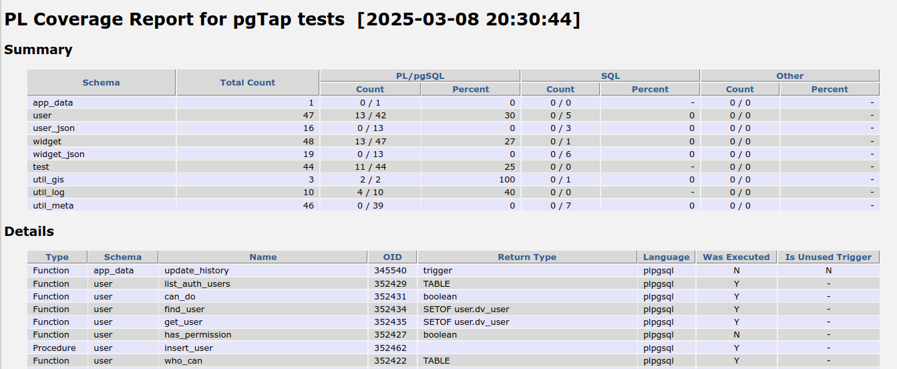
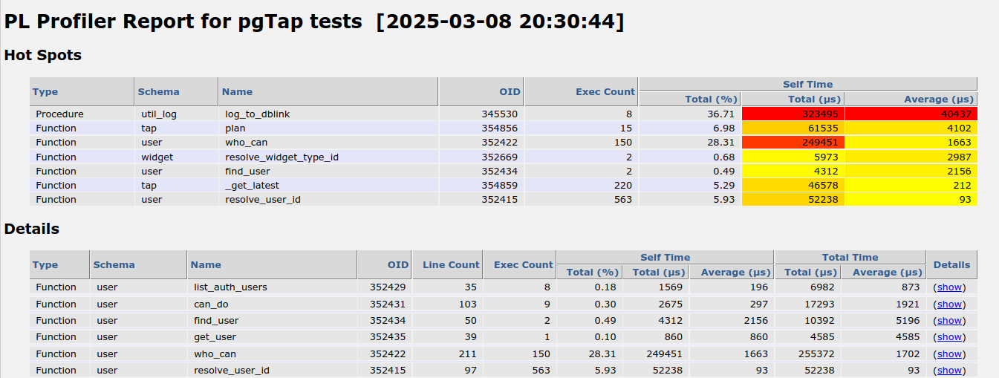
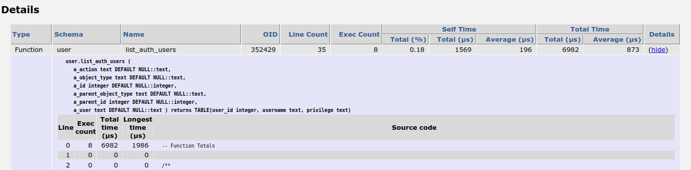

# plprofiler_client

A [plprofiler](https://github.com/bigsql/plprofiler) client written in plsql and shell.

This started when trying to use plprofiler on a RedHat box and finding that the
client didn't work due to some files missing from the system python.

The goal was to use plprofiler in conjunction with
[pgTap](https://github.com/theory/pgtap) in order to both measure performance and
test coverage.

Wanting different reporting than that provided by python client and not wanting
to deal with maintaining a separate python install just to run one CLI app
resulted in extracting queries from the python and storing them in the
database. Adding a couple of new reports and some shell (bash actually)
scripting and this tool was born.

# Usage

Load the profiler_client schema into the database:

    ```
    cd profile_client
    psql ... -f schema.sql
    ```

then include the client.sh script in the testing (bash) script:

    ```
    #!/usr/bin/env base

    # ... whatever initialization is needed

    source client.sh

    init_plprofiler

    # ... the testing to profile

    generate_plprofiler_reports

    ```

# Report output

## Coverage report

The coverage report consists of two sections, a summary showing counts and
percentages by schema and a details section that lists all functions and
procedures and whether they were executed or not.



## Profiler report

The profiler report contains a hot spots section that lists the
functions/procedures that have either the highest total self-time or the
highest average self-time as well as a details section that lists the profile
data that was gathered for all functions and procedures with.



Clicking on the details link for any given function/procedure expands the
profile data to show the line-by-line profile data for that function/procedure.



# Limitations

This is subject to the same limitations as plprofiler... namely that SQL
functions don't show up in the profiler data.
